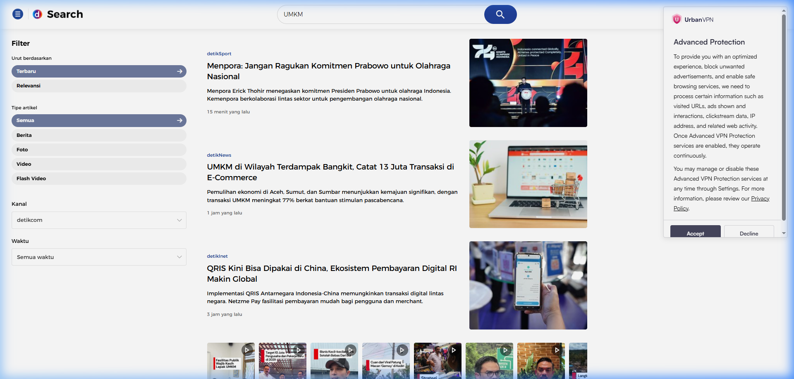
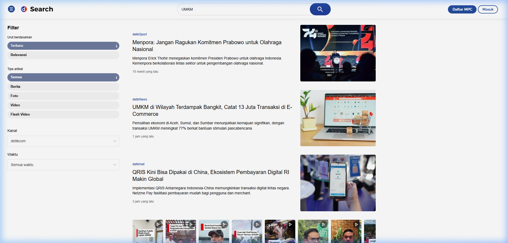

# Manual Book - Inercorp News Scraper

Panduan penggunaan skrip web scraping multi-sumber untuk berita UMKM dan Bencana di Indonesia.

---

## 1. Persiapan Awal
Sebelum menjalankan skrip, pastikan Anda telah memiliki hal-hal berikut:
- **Python 3.x** terinstal di komputer.
- **Koneksi Internet** yang stabil.
- Semua library pendukung sudah terinstal (Otomatis dilakukan oleh `run.bat`).

---

## 2. Pengaturan Kata Kunci
Buka file `keyword.txt` dan masukkan kata kunci yang ingin Anda cari. Gunakan satu baris untuk setiap kata kunci.

**Contoh isi `keyword.txt`:**
```text
UMKM terdampak bencana
Pemulihan UMKM pasca gempa
Bantuan modal UMKM sumatera
```

---

## 3. Konfigurasi Sistem
Buka file `config.py` jika Anda ingin mengubah rentang tahun atau sumber berita.

```python
# Contoh di config.py
START_YEAR = 2020
END_YEAR = 2026
```

---

## 4. Cara Menjalankan Scraper
Untuk menjalankan program, Anda hanya perlu mengklik dua kali file **`run.bat`**.

### Tampilan Saat Berjalan (Progress Bar)
Skrip akan menampilkan progress bar di terminal untuk memantau kemajuan proses scraping.


*Gambar 1: Tampilan Progress Bar di CLI.*

---

## 5. Melihat Hasil Scraping
Hasil scraping akan disimpan ke dua tempat:
1. **File Arsip**: Berupa file CSV dengan tanda waktu (misal: `hasil_scrapping_20260510.csv`).
2. **Database Utama (`dataset.csv`)**: File gabungan seluruh hasil scraping tanpa ada duplikat judul.

### Contoh Tampilan di Excel / WPS Office

*Gambar 2: Data hasil scraping yang sudah memiliki isi lengkap dan tanggal asli.*

---

## 6. Tips & Troubleshooting
- **Permission Denied**: Jika muncul error ini, pastikan file `dataset.csv` sedang **TIDAK DIBUKA** di Excel atau WPS Office. Tutup aplikasi tersebut lalu jalankan kembali skrip.
- **Duplikat**: Skrip akan otomatis melewati berita yang judulnya sudah ada di `dataset.csv` untuk menghemat waktu.
- **Tanggal Berita**: Skrip mengambil tanggal asli dari metadata artikel. Jika tidak ditemukan, baru akan menggunakan tanggal hari ini.

---

**Inercorp News Scraper v2.0**  
*Automated Intelligence for News Data Gathering*
